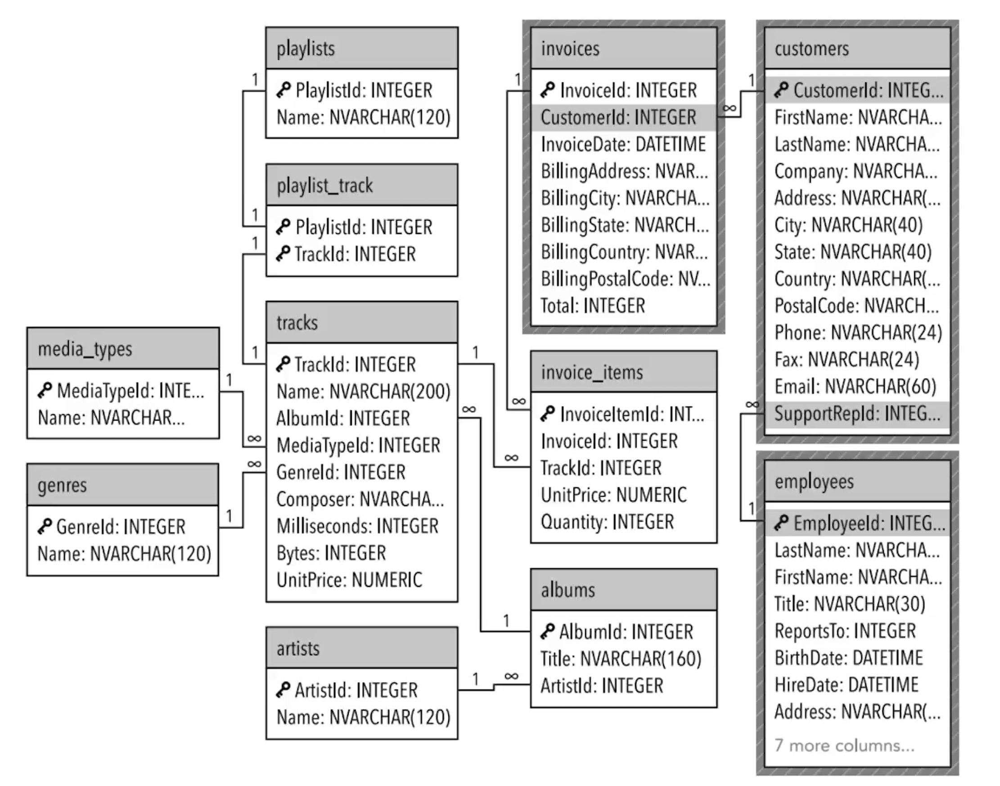
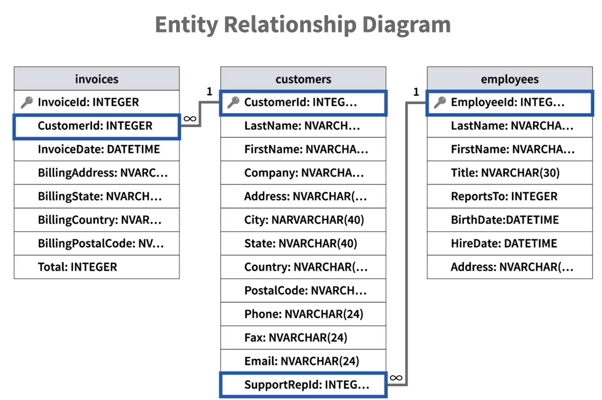
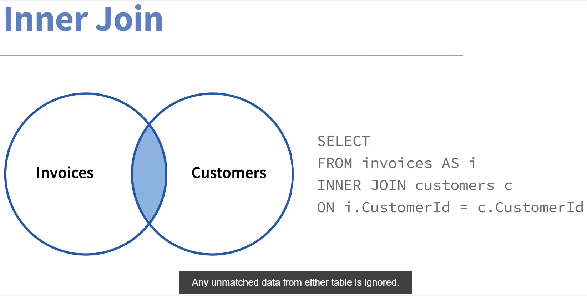
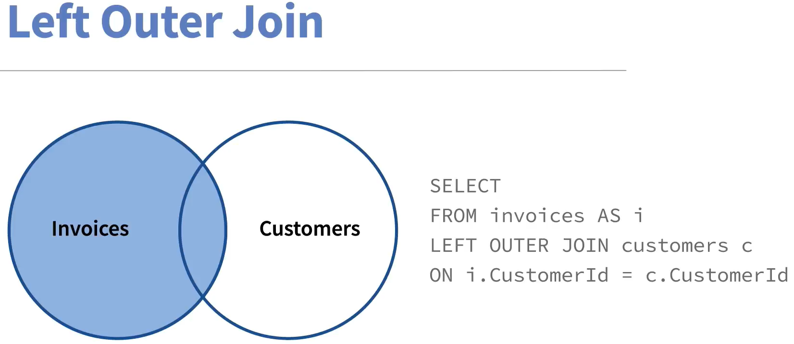
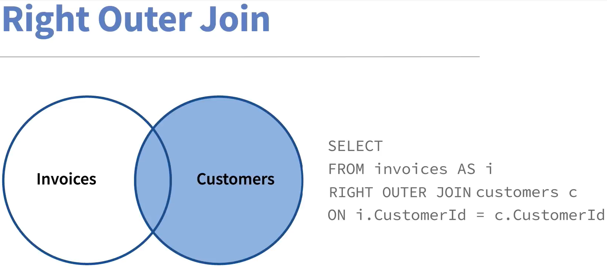

### This respository was intended for revising my sql skills and getting sertificate from LinkedIn Learning platform

### Certificates:

1. [LinkedIn Learning Certificate](https://www.linkedin.com/learning/certificates/548f7d358b11c39bce0c621fe7fe6b908c61f00c7106c7cf47a66c6c1b94617c)

2. [National Association of State Boards of Accountancy (NASBA)](https://www.linkedin.com/learning/certificates/3a7a9729dceac85c10dfaa50187d9d1329dc2ed7d060e4321707a44221d3c004)

#### Some concepts & ERDs (Entity Relation Diagram):

Contents:
===========================================================
* bddcc73 chapter 4, using select, aliases, order and limit
* a5c9ca2 chapter 5, lesson 2 - using WHERE 😄 (I've run a little ahead)
* 97865bf working database added
* 75fa8ba chapter 5, lesson 3 - using BETWEEN and IN
* 0ec6f26 chapter 5, lesson 4 - using WHERE for string data
* ce15fd6 chapter 5, lesson 5 - using LIKE with %
* 42ccb98 chapter 5, lesson 6 - searching by date, using Date() function
* 5c4df92 chapter 5, lesson 7 - using more than one WHERE conditions
* 3bdcc57 chapter 5, lesson 8 - using logical operator OR
* e632322 chapter 5, lesson 9 - brackets or order
* 841829e chapter 5, lesson 10 - IF THEN logic with CASE
* 4647eb3 chapter 6, lesson 2 - Relations, using JOIN
* f87f236 chapter 6, lesson 3 - simplifiing JOIN's using aliases
* a78a79d chapter 6, lesson 6 - INNER JOIN
* f11c853 chapter 6, lesson 7 - LEFT OUTER JOIN
* 434ee7f chapter 6, lesson 8 - RIGHT OUTER JOIN
* f31a2d3 chapter 6, lesson 9 - big entity relational diagram
* 5f5de72 chapter 6, lesson 10 - joining many tables
* 37da4d1 chapter 7, lesson 2 - types of functions: string, date, aggregate
* cfa179a chapter 7, lesson 3 - connecting strings
* b91bb62 chapter 7, lesson 4 - using functions LENGTH, SUBSTR
* cda93a3 chapter 7, lesson 5 - using functions UPPER, LOWER
* 3919116 chapter 7, lesson 6 - using date functions and make simple calculation
* b99977d chapter 7, lesson 7 - using aggregate functions
* 3d8fc8e chapter 7, lesson 8 - using nesting  functions and function ROUND
* 65c1230 chapter 8, lesson 2 - using grouping
* 73f9910 chapter 8, lesson 3 - using GROUP BY with WHERE
* b001b78 chapter 8, lesson 4 - using HEAVING
* 4d935ec chapter 8, lesson 5 - using WHERE, GROUP BY and HEAVING
* b86ff54 chapter 8, lesson 6 - grouping by many fields
* 3739daa chapter 9, lesson 2 - using subqueries
* 90a37d8 chapter 9, lesson 3 - subqueries in SELECT
* e80446c chapter 9, lesson 4 - subqueries without aggregate
* 18c0ef3 chapter 9, lesson 5 - return multiple values from the subquery
* 630e84a chapter 9, lesson 6 - subquery with DISTINCT with NOT IN
* 587f491 chapter 10, lesson 2 - creating VIEW
* 58c1367 chapter 10, lesson 4 - creating VIEWs & JOINs
* f8bcf11 chapter 10, lesson 5 - deleting VIEWs
* a0ff4f3 chapter 11, lesson 2 - DML, INSERT
* 21c25f8 chapter 11, lesson 3 - DML, UPDATE
* 0f9df91 chapter 11, lesson 4 - DML, DELETE
* 716921b adds README.md, renaming img files for readability